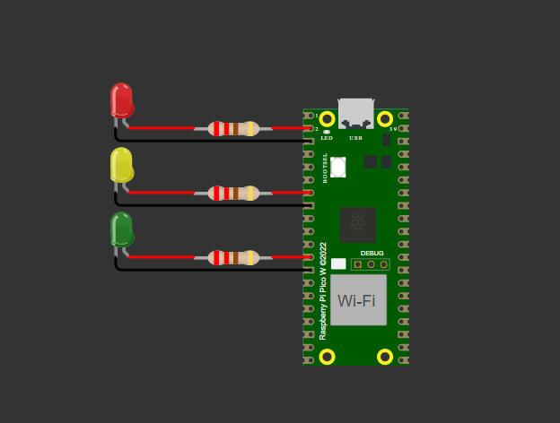
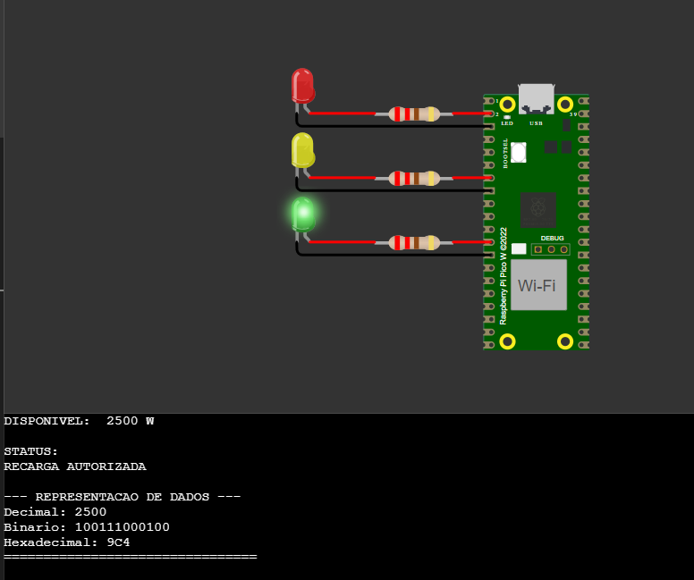
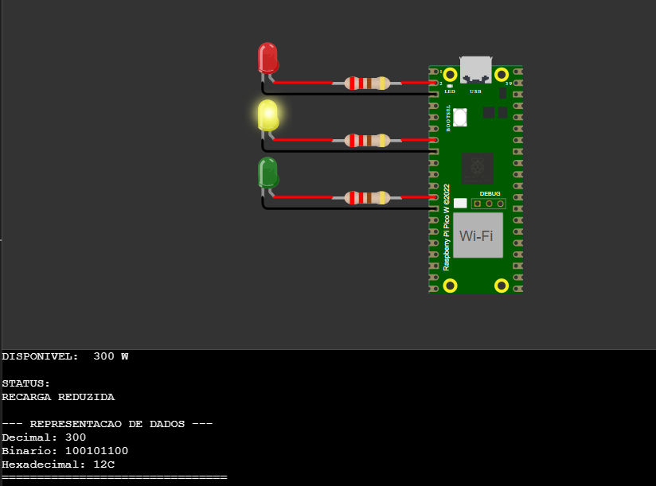
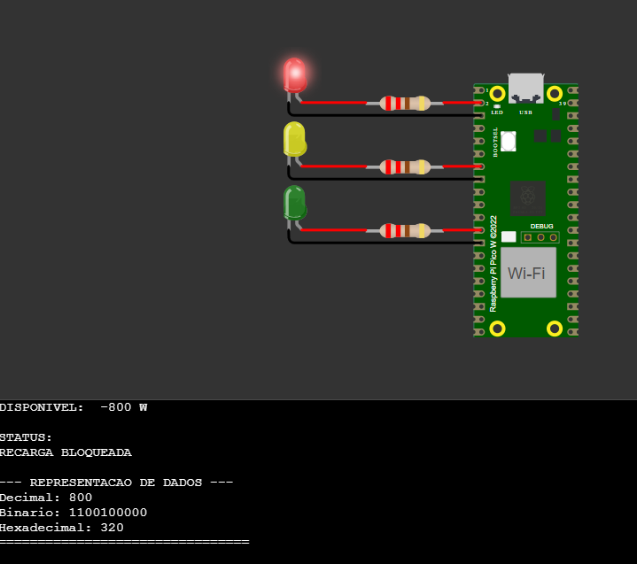

# Smart Energy Controller

Protótipo educacional de um sistema inteligente de controle de sessão de recarga desenvolvido com **Raspberry Pi Pico e MicroPython**.

O projeto foi desenvolvido para a disciplina de **Arquitetura de Computadores** e simula o gerenciamento da energia disponível para uma sessão de recarga, inspirado no conceito de controladores inteligentes de energia como o GoodWe Smart Energy Controller.

## Objetivo

O sistema compara a potência de geração de energia com o consumo da residência e calcula a energia disponível:

```text
Energia disponível = Geração - Consumo
```

A partir desse resultado, o Raspberry Pi Pico determina um dos três estados da sessão de recarga.

| Estado | Condição | LED |
|---|---|---|
| Recarga autorizada | Energia disponível >= 1000 W | Verde |
| Recarga reduzida | Energia disponível entre 1 W e 999 W | Amarelo |
| Recarga bloqueada | Energia disponível <= 0 W | Vermelho |

O limite de 1000 W foi adotado exclusivamente como parâmetro didático para o protótipo.

## Hardware

- Raspberry Pi Pico
- 1 LED verde
- 1 LED amarelo
- 1 LED vermelho
- 3 resistores de 220 Ω ou 330 Ω
- Jumpers


Cada LED deve ser conectado utilizando um resistor limitador de corrente.



### Energia suficiente

```text
Geração: 4000 W
Consumo: 1500 W
Disponível: 2500 W

RECARGA AUTORIZADA
```
O LED verde é acionado.

### Energia limitada

```text
Geração: 1800 W
Consumo: 1500 W
Disponível: 300 W

RECARGA REDUZIDA
```
O LED amarelo é acionado.

### Energia insuficiente

```text
Geração: 1000 W
Consumo: 1800 W
Disponível: -800 W

RECARGA BLOQUEADA
```
O LED vermelho é acionado.

## Arquitetura de Computadores

O projeto demonstra os principais elementos estudados em Arquitetura de Computadores.


### Processamento

O processador RP2040 executa a subtração `geração - consumo` e as comparações com 0 W e 1000 W. Essas operações aritméticas e lógicas determinam qual trecho do programa será executado.

### Memória

Durante a execução, variáveis como `geracao`, `consumo`, `energia_disponivel` e `status` são mantidas na memória RAM.

O programa `main.py` e o firmware MicroPython permanecem na memória flash, que é não volátil.

### Saída

Os pinos GPIO controlam os LEDs, formando a saída visual. O Monitor Serial é outra saída e apresenta os valores calculados e o estado da sessão.

## Representação de dados

Exemplo utilizando uma potência disponível de 2500 W:

```text
Decimal:      2500
Binário:      100111000100
Hexadecimal:  9C4
```

Isso demonstra que uma mesma informação pode ser representada utilizando diferentes sistemas numéricos.

O programa faz essa conversão automaticamente para cada cenário. Quando o valor é negativo, a saída usa **sinal e magnitude** (por exemplo, `-800`, `-1100100000` e `-320`) para tornar a demonstração mais clara. Essa escolha é didática; internamente, a representação usada pelo interpretador depende da implementação do MicroPython.

## Tecnologias

- Raspberry Pi Pico
- RP2040
- MicroPython
- Wokwi

## Evidências dos três estados

| Energia suficiente | Energia limitada | Energia insuficiente |
|---|---|---|
|  |  |  |

## Estrutura do repositório

```text
smart-energy-controller/
├── main.py                 # programa MicroPython
├── diagram.json            # circuito para o Wokwi
├── README.md               # documentação técnica e instruções
└── docs/
    ├── circuito.png
    ├── led-verde.png
    ├── led-amarelo.png
    ├── led-vermelho.png
    └── roteiro-video.md
```